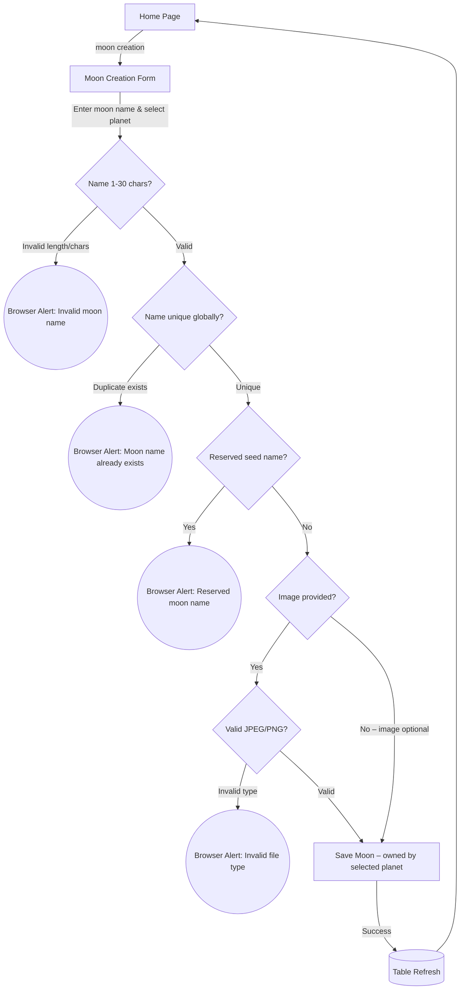

```mermaid
graph TD
    Home[Home Page] -->|moon creation| MoonForm[Moon Creation Form]
    MoonForm -->|Enter moon name & select planet| NameCheck{Name 1-30 chars?}
    NameCheck -->|Invalid length/chars| NameAlert((Browser Alert: Invalid moon name))
    NameCheck -->|Valid| UniqueCheck{Name unique globally?}
    UniqueCheck -->|Duplicate exists| DupAlert((Browser Alert: Moon name already exists))
    UniqueCheck -->|Unique| ReservedCheck{Reserved seed name?}
    ReservedCheck -->|Yes| ReservedAlert((Browser Alert: Reserved moon name))
    ReservedCheck -->|No| ImageChoice{Image provided?}
    ImageChoice -->|Yes| FileCheck{Valid JPEG/PNG?}
    FileCheck -->|Invalid type| FileAlert((Browser Alert: Invalid file type))
    FileCheck -->|Valid| SaveMoon[Save Moon – owned by selected planet]
    ImageChoice -->|No – image optional| SaveMoon
    SaveMoon -->|Success| TableRefresh[(Table Refresh)]
    TableRefresh --> Home
```