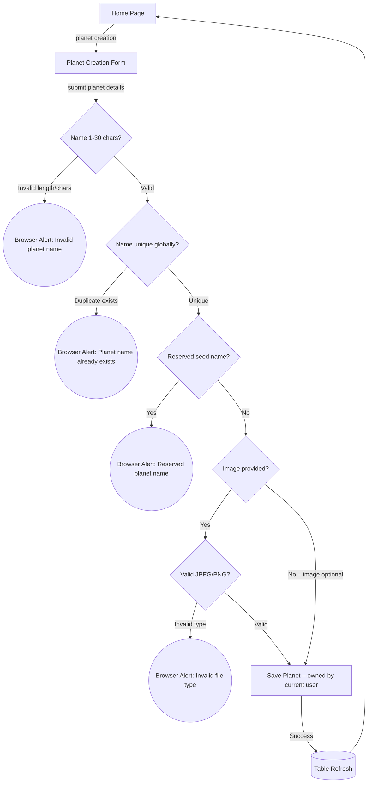

```mermaid
graph TD
    Home[Home Page] -->|planet creation| CreateForm[Planet Creation Form]
    CreateForm -->|submit planet details| NameCheck{Name 1-30 chars?}
    NameCheck -->|Invalid length/chars| NameAlert((Browser Alert: Invalid planet name))
    NameCheck -->|Valid| UniqueCheck{Name unique globally?}
    UniqueCheck -->|Duplicate exists| DupAlert((Browser Alert: Planet name already exists))
    UniqueCheck -->|Unique| ReservedCheck{Reserved seed name?}
    ReservedCheck -->|Yes| ReservedAlert((Browser Alert: Reserved planet name))
    ReservedCheck -->|No| ImageChoice{Image provided?}
    ImageChoice -->|Yes| FileCheck{Valid JPEG/PNG?}
    FileCheck -->|Invalid type| FileAlert((Browser Alert: Invalid file type))
    FileCheck -->|Valid| SavePlanet[Save Planet – owned by current user]
    ImageChoice -->|No – image optional| SavePlanet
    SavePlanet -->|Success| TableRefresh[(Table Refresh)]
    TableRefresh --> Home
```