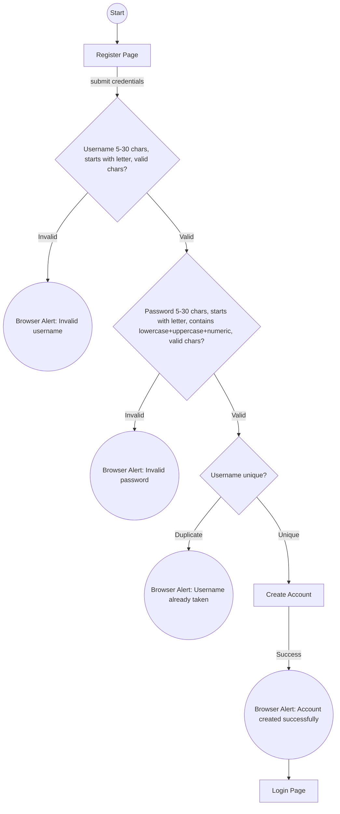

```mermaid
graph TD
    Start((Start)) --> RegisterPage[Register Page]
    RegisterPage -->|submit credentials| UsernameCheck{Username 5-30 chars, starts with letter, valid chars?}
    UsernameCheck -->|Invalid| UsernameAlert((Browser Alert: Invalid username))
    UsernameCheck -->|Valid| PasswordCheck{Password 5-30 chars, starts with letter, contains lowercase+uppercase+numeric, valid chars?}
    PasswordCheck -->|Invalid| PasswordAlert((Browser Alert: Invalid password))
    PasswordCheck -->|Valid| UniqueCheck{Username unique?}
    UniqueCheck -->|Duplicate| DupAlert((Browser Alert: Username already taken))
    UniqueCheck -->|Unique| CreateAccount[Create Account]
    CreateAccount -->|Success| AccountCreated((Browser Alert: Account created successfully))
    AccountCreated --> LoginPage[Login Page]
```